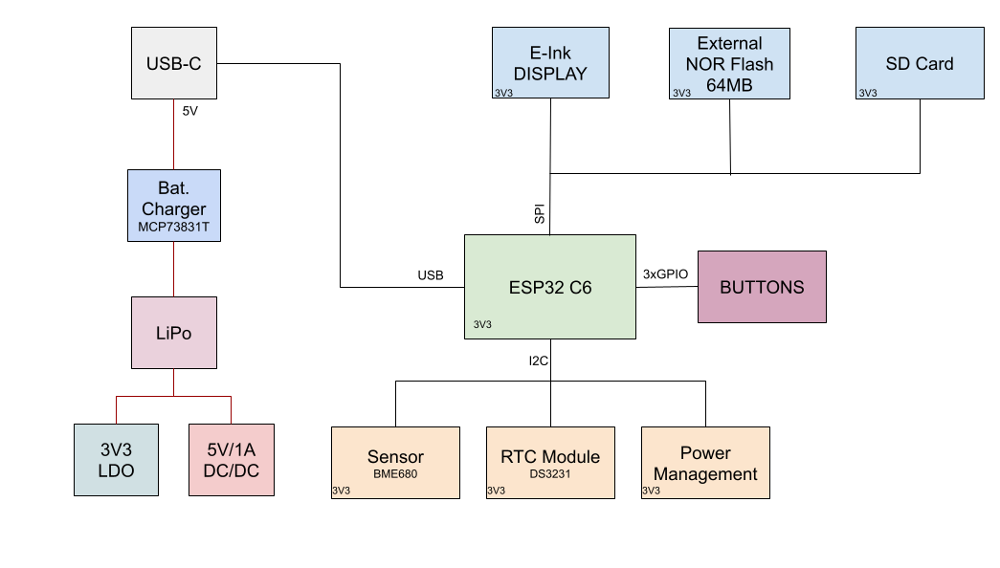

```
        .--.                   .---.
    .---|__|           .-.     |~~~|
.--|===|--|_          |_|     |~~~|--.
|  |===|  |'\     .---!~|  .--|   |--|		   ___                   ____              _    
|%%|   |  |.'\    |===| |--|%%|   |  |		  / _ \ _ __   ___ _ __ | __ )  ___   ___ | | __
|%%|   |  |\.'\   |   | |__|  |   |  |		 | | | | '_ \ / _ \ '_ \|  _ \ / _ \ / _ \| |/ /
|  |   |  | \  \  |===| |==|  |   |  |		 | |_| | |_) |  __/ | | | |_) | (_) | (_) |   < 
|  |   |__|  \.'\ |   |_|__|  |~~~|__|		  \___/| .__/ \___|_| |_|____/ \___/ \___/|_|\_\
|  |===|--|   \.'\|===|~|--|%%|~~~|--|		       |_|                                      
^--^---'--^    `-'`---^-^--^--^---'--'
```

## Table of Contents

1. [Block Diagram](#block-diagram)
2. [Bill of Materials (BOM)](#bill-of-materials-(bom))
3. [Components. Functionality. Measurements](#components-functionality-measurements)
4. [ESP32 C6 Pin Connections](#esp32-c6-pin-connections)
5. [Design Comments]()

## Block Diagram



## Bill of Materials (BOM)

| Component | Link | Datasheet |
|-----------|-------------|-----------|
| Buttons (x3) | [Mouser](https://ro.mouser.com/ProductDetail/E-Switch/TL3315NF250Q?qs=g35H13458Kaz43%252B3owu1iQ%3D%3D) | [Datasheet](https://www.mouser.com/datasheet/2/140/TL3315-345930.pdf?srsltid=AfmBOoqCqHlNTSgC-O2LFAWm6s4LAd71f8YVI18lGMMVCCY181TTsQEw)|
| BD5229G-TR | [Digikey](https://www.digikey.ee/en/models/658502) | [Datasheet](https://fscdn.rohm.com/en/products/databook/datasheet/ic/power/voltage_detector/bd52xxg-e.pdf)|
| CPH3225A | [SnapMagic](https://www.snapeda.com/parts/CPH3225A/Seiko+Instruments/view-part/?ref=eda) | [Datasheet](https://www.snapeda.com/parts/CPH3225A/Seiko%20Instruments/datasheet/) |
| Diode | [DigiKey](https://www.digikey.com/en/products/detail/littelfuse-inc/PGB1010603MR/715755?utm_source=snapeda&utm_campaign=buynow&utm_medium=aggregator) | [Datasheet](https://www.littelfuse.com/assetdocs/pulseguard-esd-suppressors-pgb1-datasheet?assetguid=8a337998-d54d-466b-be4e-dc5bcd1f9321) |
| Display Connector | [SnapMagic](https://www.snapeda.com/parts/FH34SRJ-24S-0.5SH(99)/Hirose/view-part/) | [Datasheet](https://ro.mouser.com/datasheet/2/185/FH34SRJ_24S_0_5SH_99__CL0580_1255_6_99_2DDrawing_0-1615044.pdf)|
| Environmental Sensor BME680 | [DigiKey](https://www.digikey.com/en/products/detail/bosch-sensortec/bme680/7401317) | [Datasheet](https://www.bosch-sensortec.com/media/boschsensortec/downloads/datasheets/bst-bme680-ds001.pdf)	|
| ESP32 C6 | [Mouser](https://ro.mouser.com/ProductDetail/Espressif-Systems/ESP32-C6-WROOM-1-N8?qs=8Wlm6%252BaMh8ST02Gmwp74cw%3D%3D) | [Datasheet](https://ro.mouser.com/datasheet/2/891/Espressif_ESP32_C6_WROOM_1__Datasheet_V0_1_PRELIMI-3239987.pdf)|
| External NOR Flash (64MB) | [Mouser](https://ro.mouser.com/ProductDetail/Winbond/W25Q512JVEIQ?qs=l7cgNqFNU1jw6svr3at6tA%3D%3D) | [Datasheet](https://ro.mouser.com/datasheet/2/949/Winbond_W25Q512JV_Datasheet-3240039.pdf)|
| Led | [GrabCAD](https://grabcad.com/library/0603-smd-led-1) | [Datasheet](https://www.snapeda.com/parts/KP-1608SURCK/Kingbright/datasheet/) |
| MAX17048G+T10	| [SnapMagic](https://www.snapeda.com/parts/MAX17048G+T10/Analog+Devices/view-part/?ref=eda) | [Datasheet](https://www.snapeda.com/parts/MAX17048G+T10/Analog%20Devices/datasheet/) |
| Li-Po Battery Charging Controller | [Mouser](https://ro.mouser.com/ProductDetail/Microchip-Technology/MCP73831T-3ACI-OT?qs=yUQqVecv4quInAWkk8YFWg%3D%3D) | [Datasheet](https://ro.mouser.com/datasheet/2/268/MCP73831_Family_Data_Sheet_DS20001984H-3441711.pdf)|
| LDO Regulator | [Mouser](https://ro.mouser.com/ProductDetail/Torex-Semiconductor/XC6220A331MR-G?qs=AsjdqWjXhJ8ZSWznL1J0gg%3D%3D) | [Datasheet](https://ro.mouser.com/datasheet/2/760/xc6220-3371556.pdf)|
| N-channel MOSFET | [DigiKey](https://www.digikey.ro/ro/products/detail/vishay-siliconix/SI1308EDL-T1-GE3/4876435?s=N4IgTCBcDaIMoEkCMBmADADgKIBEAyAtACpIEDiWKIAugL5A) | [Datasheet](https://www.vishay.com/docs/63399/si1308edl.pdf)|
| P-channel MOSFET | [DigiKey](https://www.digikey.com/en/products/detail/diodes-incorporated/DMG2305UX-7/4340667) | [Datasheet](https://www.diodes.com/assets/Datasheets/DMG2305UX.pdf) |
| PFMF.050.2 | [Mouser](https://eu.mouser.com/ProductDetail/Schurter/PFMF0502?qs=1auRipcfynCums5v1iucSA%3D%3D&utm_source=findchips&utm_medium=aggregator&utm_campaign=PFMF0502&utm_term=PFMF0502&utm_content=Schurter) | [Datasheet](https://ro.mouser.com/datasheet/2/358/typ_PFMF-1275918.pdf) |
| Power Inductor | [Mouser](https://ro.mouser.com/ProductDetail/Bourns/SRR4828A-101M?qs=EU6FO9ffTwcw5i9FweW3JA%3D%3D) | [Datasheet](https://ro.mouser.com/datasheet/2/54/srr4828a-1391533.pdf)|
| Qwiic | [DigiKey](https://www.digikey.com/en/products/detail/onion-corporation/om-e-qwiic/9922970) | [Datasheet](https://cdn.sparkfun.com/assets/parts/1/2/2/8/9/Qwiic_Connector_Datasheet.pdf)|
| RCL CPOL 3528 | [DigiKey](https://www.snapeda.com/parts/TAJB475K025RNJ/AVX/view-part/?ref=dk&t=capacitor%203528&con_ref=None) | [Datasheet](https://s3.amazonaws.com/snapeda/datasheet/TAJB475K025RNJ_AVX.pdf) |
| Resistors | [Mouser](https://ro.mouser.com/c/?q=resistor%200402) | [Datasheet](https://ro.mouser.com/c/?q=resistor%200402)|
| Schottky Diodes | [Mouser](https://ro.mouser.com/ProductDetail/KYOCERA-AVX/SD0805S020S1R0?qs=jCA%252BPfw4LHbpkAoSnwrdjw%3D%3D) | [Datasheet](https://ro.mouser.com/datasheet/2/40/schottky-3165252.pdf)|
| SD Module | [Comet](https://store.comet.srl.ro/Catalogue/Product/43497/) | [Datasheet](https://store.comet.bg/download-file.php?id=8824)|
| SMC Diode | [DigiKey](https://www.digikey.ro/ro/products/detail/smc-diode-solutions/MBR0530/16692306) | [Datasheet](https://www.smc-diodes.com/propdf/MBR0530%20N0717%20REV.A.pdf)|
| Transistors | [Mouser](https://ro.mouser.com/ProductDetail/Diodes-Incorporated/DMG2305UX-7?qs=L1DZKBg7t5F%2FNBHrjfxC%252Bg%3D%3D) | [Datasheet](https://www.diodes.com/assets/Datasheets/DMG2305UX.pdf)|
| TP20R | [Mouser](https://eu.mouser.com/ProductDetail/Adafruit/3825?qs=%252bEew9%252b0nqrAn6n76%252bB5vZg%3D%3D&utm_source=findchips&utm_medium=aggregator&utm_campaign=3825&utm_term=3825&utm_content=Adafruit) | [Datasheet](https://cdn-shop.adafruit.com/product-files/3825/3825_diagram.PDF) |
| USB-C Connector | [Mouser](https://ro.mouser.com/ProductDetail/GCT/USB4110-GF-A?qs=KUoIvG%2F9IlYiZvIXQjyJeA%3D%3D) | [Datasheet](https://ro.mouser.com/datasheet/2/837/GCT_USB4110_Product_Drawing___20k_cycles-3455479.pdf)|
| USBLC6-2SC6Y | [Digikey](https://www.digikey.ro/ro/products/detail/stmicroelectronics/USBLC6-2SC6Y/2819177?s=N4IgTCBcDaIKoGUBCAZAwgNgLRgZgmiALoC%2BQA) | [Datasheet](https://www.st.com/content/ccc/resource/technical/document/datasheet/group0/94/15/6c/58/ba/91/46/42/DM00055262/files/DM00055262.pdf/jcr:content/translations/en.DM00055262.pdf)|

## Components. Functionality. Measurements

The system is built around an **ESP32 C6 microcontroller** featuring a RISC-V 32-bit architecture with integrated Wi-Fi 6 (802.11ax), Bluetooth 5 with Long Range support, and Zigbee/Thread capabilities for low-power mesh networking. Operating at 160 MHz with a 4-stage pipeline, it includes 320KB ROM, 528KB SRAM (512KB high-performance + 16KB low-power), and 30 GPIO pins. This central processor manages all communications, peripherals, and power consumption (160μA in deep sleep, 10mA active).

The visual interface is a **7.5-inch E-Paper (E-Ink) display** with 800×480 resolution, connected via SPI. This low-power display (1.2mW active, 0.1mW standby) maintains image visibility without power, making it ideal for battery-efficient applications. Key connections include MOSI, SCK, CS, DC, RST, and BUSY pins to the ESP32.

For environmental monitoring, a **BME688 multi-sensor** provides comprehensive measurements including:
- Gas detection (VOCs, CO, hydrogen)
- Humidity sensing (0-100% RH, ±3% accuracy)
- Temperature monitoring (-40°C to 85°C, ±0.5°C accuracy)
- Pressure detection (300-1100 hPa, ±0.6 hPa accuracy)

This I2C-connected sensor consumes approximately 3.6mA during measurements and just 0.1μA in sleep mode.

Power is supplied by a **3.7V 1800-2500mAh LiPo battery** (CELLEVIA LP584174) with USB-C charging capability. The system employs an **MCP73831T charging controller** for efficient battery management including precharge/fast charge modes, thermal regulation, and overvoltage protection. A dedicated **LDO voltage regulator** stabilizes the 3.3V supply for components, while a **voltage supervisor** monitors power levels and handles system resets when necessary.

The device features multiple storage options:
- **MicroSD card slot** (up to 32GB, FAT32) for e-books and user data, connected via SPI
- **64MB External NOR Flash** for firmware and critical system data
- **DS3231 RTC module** provides accurate timekeeping even during power loss, with battery backup and I2C connectivity

User input is facilitated through **three tactile push buttons** connected to GPIO pins for navigation and control functions. An **I2C-based QWIIC/Stemma QT connector** enables easy integration of additional modules and sensors.

The board includes comprehensive connectivity through:
- USB-C connector with ESD protection (PFMF varistor) and reverse polarity protection (Schottky barrier diode)
- Wi-Fi 6 and Bluetooth 5 wireless capabilities
- Various test pads for debugging and development


## ESP32 C6 Pin Connections

| Pin/Port    | Connected To             | Description                                       |
|-------------|--------------------------|---------------------------------------------------|
| EN          | RESET Button             | Hardware reset button                             |
| IO0         | INT_RTC                  | Interrupt signal from RTC                         |
| IO1         | 32KHz                    | 32kHz clock signal input                          |
| IO2         | MISO                     | Master In Slave Out for SPI devices               |
| IO3         | EPD_BUSY                 | E-Ink display busy status indicator               |
| IO4         | SS_SD                    | Chip select for SD card                           |
| IO5         | EPD_DC                   | Data/Command control for E-Ink display            |
| IO6         | SCK                      | SPI clock signal                                  |
| IO7         | MOSI                     | Master Out Slave In for SPI devices               |
| IO8         | 3V3                      | 3.3V power supply                                 |
| IO9         | BOOT Button              | Boot mode selection button                        |
| IO10        | EPD_CS                   | Chip select for E-Ink display                     |
| IO11        | FLASH_CS                 | Chip select for external Flash memory             |
| IO12        | USB_D-                   | USB data negative                                 |
| IO13        | USB_D+                   | USB data positive                                 |
| IO15        | CHANGE Button            | User action button                                |
| IO16/TXD0   | TX (UART)                | UART transmit line                                |
| IO17/RXD0   | RX (UART)                | UART receive line                                 |
| IO18        | RTC_RST                  | Reset line for RTC module                         |
| IO19        | I2C_PW                   | Power control for I2C devices                     |
| IO20        | EPD_3V3_C                | 3.3V power for E-Ink display                      |
| IO21        | SDA                      | I2C data line (BME688, DS3231, MAX17048)          |
| IO22        | SCL                      | I2C clock line (BME688, DS3231, MAX17048)         |
| IO23        | EPD_RST                  | Reset line for E-Ink display                      |
| 3V3         | Power Rail               | 3.3V power distribution                           |
| GND         | Ground                   | Common ground connection                          |

## Design Comments

While DRC throws two Board Outline Clearance errors, I have decided to keep the position of the J2 USB C Connector as is.
This is so that the component reaches the margin of the ebook reader and can be used by the client.
